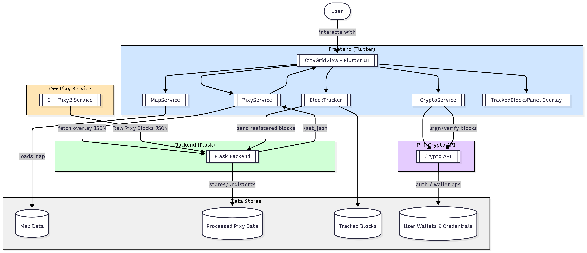

# BrickMMO Pixy Vision + Crypto System

A comprehensive computer vision and blockchain-based interaction system for the BrickMMO ecosystem. It combines **Pixy2 camera-based LEGO block detection** with a **PHP cryptocurrency wallet and blockchain system**, enabling real-time block tracking and tokenized transactions.

---

## 📋 System Overview

This system provides:

1. **C++ Pixy2 Detection Application** – Camera interface and block detection
2. **Flask Backend API** – Data processing, storage, and image handling
3. **Flutter Frontend** – Real-time visualization and user interface
4. **PHP-Crypto-Wallet** – A simplified blockchain and cryptocurrency wallet for block transactions

Together, these allow LEGO blocks in BrickMMO to be **detected, tracked, and assigned crypto-based ownership and value.**

---

## 🏗 Architecture

```
Physical Layer:    [Pixy2 Cameras] → USB → [Computer / Raspberry Pi]
Detection Layer:   [C++ Application] → HTTP → [Flask Backend]
Data Layer:        [MongoDB] ←→ [Flask Backend] ←→ [Flutter Frontend]
Crypto Layer:      [PHP Wallet + Blockchain] ←→ [Flask + Flutter APIs]
Presentation:      [Flutter Web/Mobile App] → Users
```



---

## 🚀 Quick Start

### Prerequisites

* Ubuntu/Linux system
* Python 3.7+
* Flutter SDK
* MongoDB
* Pixy2 cameras
* PHP 7.4+ (with `mysqli`, `json`, `openssl`)
* MySQL database

### Installation Steps

1. **Clone the repository**

   ```bash
   git clone <repository-url>
   cd BrickMMO-WorkStudy
   ```

2. **Set up the C++ detection application**

   ```bash
   cd pixy_cpp
   sudo apt-get install libcurl4-openssl-dev rapidjson-dev
   ./install_pixy_dependencies.sh
   g++ -o pixy_detector main.cpp -lpixy2 -lcurl -std=c++11
   ```

3. **Set up the Flask backend**

   ```bash
   cd ../back-end
   pip install -r requirements.txt
   mkdir -p static/converted_images/regular static/converted_images/clean
   ```

4. **Set up the Flutter frontend**

   ```bash
   cd ../front-end
   flutter pub get
   ```

5. **Set up the PHP crypto wallet**

   ```bash
   cd ../php-crypto-wallet
   composer install
   ```

   * Configure your MySQL database:

     ```sql
     CREATE DATABASE crypto_login;
     USE crypto_login;
     CREATE TABLE users (
         id INT AUTO_INCREMENT PRIMARY KEY,
         username VARCHAR(255) NOT NULL UNIQUE,
         password_hash VARCHAR(255) NOT NULL,
         role VARCHAR(50) DEFAULT 'user',
         wallet_address VARCHAR(255) UNIQUE,
         wallet_private_key_encrypted TEXT
     );
     ```
   * Update credentials and `ENCRYPTION_KEY` in `config.php`.

---

## 📊 Component Details

### 🔍 C++ Pixy Detection Application

* Real-time block detection
* Dual-camera support
* JSON data output via HTTP POST
* Integrates with backend for tracking

### ⚙️ Flask Backend API

* Accepts block detections (`/json_0`, `/json_1`)
* Processes and stores detections in MongoDB
* Image processing (fisheye correction, PPM → PNG)
* Interfaces with PHP wallet for transactions

### 📱 Flutter Frontend

* Grid-based visualization of LEGO city
* Interactive block tracking
* Crypto-enabled block ownership and trades
* Multi-camera visualization
* Responsive web + mobile support

### 💰 PHP Crypto Wallet

* **User Authentication** – registration/login with hashed passwords
* **Wallet Management** – generate addresses + encrypted private keys
* **Transaction System** – send/receive BrickMMO coins
* **Mining** – basic Proof-of-Work block creation
* **Blockchain Storage** – JSON-based blockchain ledger
* **Admin Tools** – add coins via admin PIN (demo only)

---

## 🔒 Security Considerations

* Current wallet stores sensitive data in **users.json** (plaintext PINs) — insecure, for demo only
* Replace with **hashed PINs** and **secure encryption** before production
* Enable **HTTPS** for all endpoints
* Implement **role-based authentication** for admin functions
* MongoDB and MySQL must be hardened with auth and restricted access

---

## 📈 Performance Optimization

### For High Throughput:

**C++ Application**

* Adjust frame processing rate
* Optimize JSON serialization
* Implement connection pooling

**Flask Backend**

* Run with Gunicorn
* Enable DB connection pooling
* Cache common queries

**Flutter Frontend**

* Optimize widget rebuilds
* Efficient grid rendering
* Use isolates for heavy computations

**PHP Crypto Wallet**

* Optimize blockchain file I/O
* Consider DB-backed transaction storage
* Add caching for wallet lookups

---

## 🎮 Usage

1. Start **MongoDB** + **MySQL**
2. Run **Flask backend**:

   ```bash
   python app.py
   ```
3. Start **Pixy detector**:

   ```bash
   sudo ./pixy_detector
   ```
4. Run **PHP wallet server**:

   ```bash
   php -S localhost:8000
   ```
5. Launch **Flutter frontend**:

   ```bash
   flutter run
   ```

Users can then:

* Detect and track blocks
* View blocks in the frontend grid
* Register wallets + mine coins
* Trade LEGO blocks with crypto transactions

---

### **Master Task Document (Chronological)**
**Project: BrickMMO (PixyCam Tracking System & Crypto Integration)**

---

### **March 2025**

#### **PixyCam Hardware & Integration**
- **Feb 18 - Mar 13**
  - Set up EV3 SDK and PixyCam SDK environments.
  - Resolved PixyCam connection issues (caused by an incompatible cable).
  - Trained PixyCam to detect objects and resolved fish-eye distortion using a radial distortion model matrix in Python (OpenCV/NumPy).
  - Configured EV3 for remote access via SSH and VS Code.
- **Mar 20**
  - Successfully compiled C++ code using a Makefile for better PixyCam integration.
  - Trained two PixyCams to detect/track red objects and aligned their physical positioning and coverage zones.
- **Mar 22**
  - Designed a JSON data format for efficient EV3-to-PC communication.

#### **Backend**
- **Mar 13**
  - Created a backend to send JSON data from the EV3 to the PC for processing.
  - Finalized the radial distortion correction algorithm to apply to detected points.
- **Mar 27**
  - Migrated the project code from a PC to a Raspberry Pi.
  - Installed necessary libraries (libusb, OpenCV) and updated the Raspberry Pi OS.
  - Rebuilt the C++ API to support multiple PixyCam instances.

#### **Frontend**
- **Mar 22**
  - Built a frontend interface with a canvas to render detected object coordinates.
  - Implemented camera zone mapping and logic for passing object data between cameras to maintain tracking continuity.

---

### **April 2025**

#### **PixyCam Hardware & Integration**
- **Apr 08**
  - Physically mounted PixyCam onto the BrickMMO city layout.
  - Trained PixyCams to track distinct colors and tested detection.
  - Identified and began troubleshooting issues with reflections affecting detection.
- **Apr 23**
  - Began debugging multi-camera conflicts where feeds were overwriting each other due to a lack of source differentiation in the backend.

#### **Backend**
- **Apr 03**
  - Developed a containerized backend using Docker.
  - Explored migrating backend logic to PHP but implemented a hybrid solution where PHP executes Python scripts for coordinate correction due to OpenCV limitations in PHP.
- **Apr 04**
  - Introduced a 0.5-second delay in PixyCam polling to reduce backend load and improve stability.
  - Implemented data validation to ensure clean tracking input.
- **Apr 10**
  - Established a full backend pipeline for real-time video capture, correction (using OpenCV Python), and transmission to the frontend.

#### **Frontend**
- **Apr 10**
  - Developed a Flutter frontend to receive and display the corrected video stream in a browser.
  - Began exploring methods for displaying multiple concurrent video feeds.
- **Apr 12**
  - Successfully implemented toggling between individual camera views.
  - Began designing a UI for a concurrent dual-view display.

#### **Database**
- **Apr 23**
  - Initialized the design of a MongoDB database schema to store spatial point data and detection events.

---

### **May 2025**

#### **PixyCam Hardware & Integration**
- **May 14**
  - Systematically troubleshooted persistent PixyCam USB detection failures on the Raspberry Pi.
  - Performed a full OS reinstallation and reinstalled all dependencies (libpixyusb2) to resolve the issue.
- **May 22**
  - Manually mapped all road locations in the BrickMMO LEGO city to grid coordinates.
  - Integrated spatial grid filtering into the C++ code to ignore detections outside of valid "road zones."

#### **Backend**
- **May 01**
  - Refactored C++ backend logic for non-blocking network requests using threading, allowing concurrent data streaming and image capture.
- **May 15**
  - Redesigned the backend architecture to tag all incoming data with a source identifier (`pc` or `pi`).
  - Implemented separate API routes and dual caching mechanisms for each data source.
- **May 17**
  - Built a system for .ppm image uploads and conversion for frame saving and streaming.

#### **Frontend**
- **May 17**
  - Fixed a critical frontend rendering bug that prevented data from the new backend routes from displaying.
  - Added camera field-of-view (FOV) overlays drawn on the grid map.
- **May 26**
  - Implemented a new Flutter UI with tab navigation for switching between camera feeds.
  - Added health-check indicators and real-time object visualization with bounding boxes.

#### **Database**
- **May 30**
  - Set up automated daily MongoDB backups with remote synchronization to secure offsite storage.

---

### **June 2025**

#### **PixyCam Hardware & Integration**
- **Jun 04**
  - Developed and deployed shell scripts on the Raspberry Pi to manage automated sleep/wake cycles and VPN reconnection, ensuring reliable remote access.

#### **Backend**
- **Jun 12**
  - Containerized all application components (backend, services) using Docker Compose for improved deployment and scalability.
- **Jun 18**
  - Set up a comprehensive monitoring solution using Grafana and Prometheus to visualize backend metrics and system health.

#### **Frontend**
- **Jun 06**
  - Unified data rendering from multiple sources (PC and Pi), implementing color-coded bounding boxes (blue for PC, green for Pi).
- **Jun 20**
  - Added a user toggle to switch between UTC and local time display for all detection timestamps.

#### **Database**
- **Jun 11**
  - Conducted stress testing on the MongoDB database under high query loads to identify and optimize bottlenecks.

---

### **July 2025**

#### **PixyCam Hardware & Integration**
- **Jul 20-25**
  - **Major Refactor:** Migrated the core C++ application from a single-threaded to a multi-threaded architecture to support multiple PixyCam cameras simultaneously.
  - Implemented thread-safe practices: atomic termination flags, mutexes for console output, and localized RapidJSON documents to prevent data races.
  - Used `std::unique_ptr` for safe image buffer management and ensured proper libcurl global initialization/shutdown.

#### **Backend & Frontend**
- **Jul 27-31**
  - **Flutter Tracking System Overhaul:** Refactored the entire Flutter frontend to use an Object-Oriented Programming (OOP) architecture.
  - Created dedicated service classes (`MapService`, `PixyService`, `BlockTracker`) for separation of concerns.
  - Implemented a sophisticated block tracking system with UUIDs, movement prediction algorithms, and smooth animations.

#### **Cryptocurrency Wallet System (New)**
- **Jul 13-19**
  - **Initial PHP Crypto Wallet Development:** Initiated a new project for a PHP-based cryptocurrency wallet and blockchain.
  - Developed core features: user authentication, wallet creation with address generation, and a basic transaction system.
  - Implemented a Proof-of-Work mining mechanism to confirm transactions and add blocks to the blockchain.
  - **Security Note:** This system was developed for educational/demonstration purposes only, with known vulnerabilities (e.g., plaintext PIN storage) and is not for production use.

---

### **August 2025**

#### **Feature Completion & Polish**
- **Aug 10-16**
  - Configured a second Raspberry Pi and PixyCam, integrating it into the VPN and backend system.
  - Expanded the Flutter `BlockPainter` to render real block data with borders and color mapping.
  - Began dashboard integration for requesting and displaying images from the Pis.
- **Aug 17-23**
  - **Project Finalization:** Fixed critical bugs and finalized the architecture.
  - **Crypto-Wallet Integration:** Implemented advanced features into the BrickMMO ecosystem:
    - **Block Wallet System:** Created unique wallet addresses auto-generated per tracked block.
    - **Spending Zones:** Designed configurable areas on the grid where blocks with sufficient coin balances could initiate micro-payments and transactions.
    - **Transaction Features:** Built a transaction confirmation flow, automatic receipt generation, and a failure recovery system.
  - Implemented predictive block rendering.
  - Pushed the entire project to GitHub and created a Dockerized version for public release.

#### **High-Throughput Optimization (New)**
- **Aug 2025**
  - **C++ Application Optimization:**
    - Adjusted the frame processing rate in the multi-threaded C++ app to balance load and latency.
    - Optimized JSON serialization/deserialization routines to reduce CPU overhead.
    - Implemented a connection pooling mechanism for backend HTTP requests to avoid the overhead of repeatedly establishing connections.
  - **Flask Backend Optimization:**
    - Configured the backend to use Gunicorn as a production WSGI server to handle concurrent requests.
    - Implemented database connection pooling for MongoDB to efficiently manage database connections under load.
    - Added caching (e.g., Redis) for frequently accessed data like map configurations and static block information.
  - **Flutter Frontend Optimization:**
    - Optimized widget rebuilds by using the `const` keyword and refactoring with `Consumer` for localized state changes.
    - Implemented efficient grid rendering using `GridView.builder` and a cell pooling system.
    - Utilized Dart Isolates to offload heavy computations, like path prediction algorithms, from the main UI thread.

---

### **Key Improvements by Month**
| **Month**   | **PixyCam & Hardware**       | **Backend**                     | **Frontend**                     | **Database & DevOps**       | **Crypto & New Systems**        |
| :---------- | :--------------------------- | :------------------------------ | :------------------------------- | :-------------------------- | :------------------------------ |
| **Mar 2025**| Initial Setup & Distortion Fix| JSON API, RPi Migration         | Canvas Rendering                 | -                           | -                               |
| **Apr 2025**| Physical Integration         | Docker, Hybrid PHP/Python       | Multi-View Feeds                 | Schema Design               | -                               |
| **May 2025**| Spatial Filtering            | Multi-Threading, Source Tagging | Flutter UI, Health Indicators    | Automated Backups           | -                               |
| **Jun 2025**| VPN Automation               | Containerization, Monitoring    | Unified Data Rendering           | Stress Testing              | -                               |
| **Jul 2025**| **Multi-Threaded C++ App**   | -                               | **OOP Refactor, Predictive Tracking** | -                           | **PHP Wallet & Blockchain Dev** |
| **Aug 2025**| Multi-Pi Setup               | **High-Throughput Optimizations** | **Wallet UI, Capture Widget**    | **CI/CD (Docker/GitHub)**   | **Crypto Integration & Payments** |

---

## 🤝 Contributing

* Maintain modular architecture
* Write tests for each new feature
* Document all API endpoints
* Follow existing code style

---

## 📄 License

* libpixyusb2 (Pixy2 SDK) – LGPL
* RapidJSON – MIT
* libcurl – MIT
* Flask – BSD
* Flutter – BSD
* PHP Wallet (MIT, demo only)

---

## 🚀 Future Enhancements

1. Smart contracts for in-game block trading
2. Multi-currency support (ETH testnet integration)
3. Tokenized LEGO NFTs for persistent ownership
4. Improved mining with difficulty adjustment
5. Real-time dashboards for block economy

